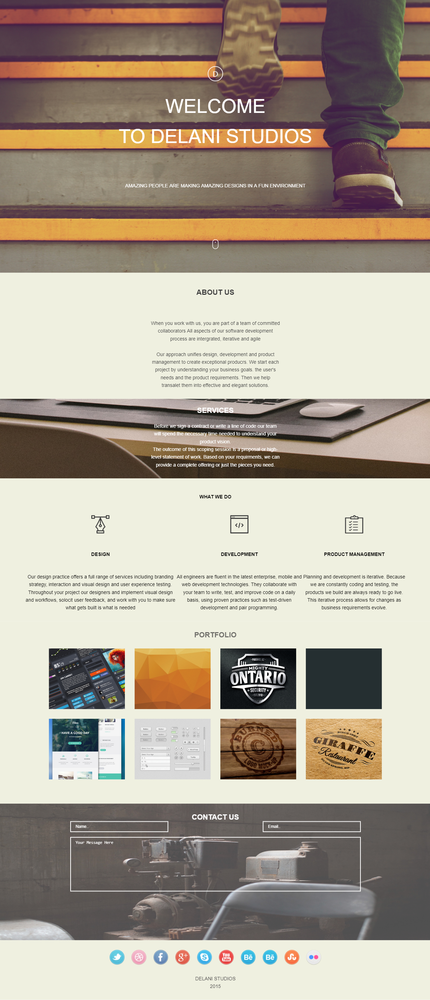

# DELANI STUDIOS
## Introduction
This a website created for a company that deals with design, software development and project management. The website is responsive so it looks good in devices of different screen sizes.
## Get started
- Clone the repo and click on the index.html file
- [Live version](https://iamkosgei.github.io/delani-studios/)
## The website is built using the following languages and libraries:
- HTML and CSS- For the design of the page.
- JQuery - This javascript library is used to make the page scroll smoothly when the mouse click icon is clicked onn the first page.

## The website structure is divided into the following sections:
- Home
- About us
- Services
- What we do
- Contact us
- Footer

# Screen shot

